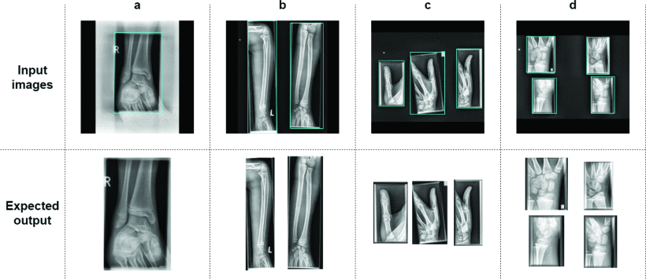

# Automatic extraction of multiple study x-ray images

- [Automatic extraction of multiple study x-ray images](#automatic-extraction-of-multiple-study-x-ray-images)
  - [Summary](#summary)
  - [Motivation](#motivation)
  - [Methods](#methods)
    - [ISA](#isa)
    - [YOLO](#yolo)
  - [Results](#results)
  - [Publications](#publications)

## Summary
This project started as a Bachelor thesis project and was continued and published as a conference paper.

The research focus is the automatic extraction of multiple study x-ray images using computer vision in both machine learning and digital image processing.

## Motivation
Because of the convenience and cost reduction, in medical radiology the standard practice sometimes includes multiple radiographs of different projections or studies in a single image. This is inconvenient for structured detection of specific injuries so it is recommended to separate these images into new images containing only one study.

## Methods
The methods include the YOLOv4 model as well as ISA (Image separation algorithm) a manually tailored method consisting of digital image processing techniques.

The data was provided by the Medical University of Graz, Department of Radiology, Division of Pediatric Radiology and consists of 4500 grayscale x-ray images.

| Number of studies | Number of x-rays |
|-------------------|------------------|
| 1                 | 21               |
| 2                 | 4399             |
| 3                 | 6                |
| 4                 | 74               |

The dataset sets:

| Set               | Number of images |
|-------------------|------------------|
| Training          | 4000             |
| Validation        | 250              |
| Test              | 250              |

### ISA
Fully manually tailored interpretative method based on standard digital image processing. The study images are resized to the same size by adding padding. Then, the images are binarized based only on the pixels contained in the x-ray study. On the binarized images the OpenCV findContours method is used to find the contours of the specific x-ray images. The detected contours are drawn in a bounding box used to determine the new separate image. Since there can be edge cases, the bounding boxes are then selected based on different criteria that can be checked in more detail in the paper.

### YOLO
Since this paper was published in 2021 YOLOv4 was used based on the accuracy and speed.

## Results
| Approach | Data set | Accuracy | Recall | Precision | F1 Score | IoU | Time (ms) | RAM (MB) |
|---|---|---:|---:|---:|---:|---:|---:|---:|
| ISA | Validation | 0.92 | 0.9746 | 0.9426 | 0.9583 | 0.8304 ± 0.2015 | 77.7627 ± 11.2202 | ~ 45 |
| YOLOv4 | Validation | 1 | 1 | 1 | 1 | 0.9017 ± 0.036 | 19.8476 ± 0.4910 | ~ 1670 |
| ISA | Test | 0.88 | 0.9283 | 0.9442 | 0.9362 | 0.8183 ± 0.2001 | 80.0647 ± 16.9544 | ~ 45 |
| YOLOv4 | Test | 0.992 | 1 | 0.992 | 0.996 | 0.8978 ± 0.079 | 19.9647 ± 1.9599 | ~ 1670 |

## Publications
[Automatic extraction of multiple-study X-ray images](https://ieeexplore.ieee.org/abstract/document/9548551)